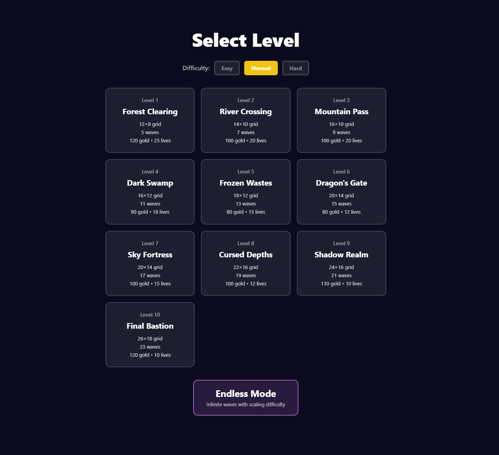
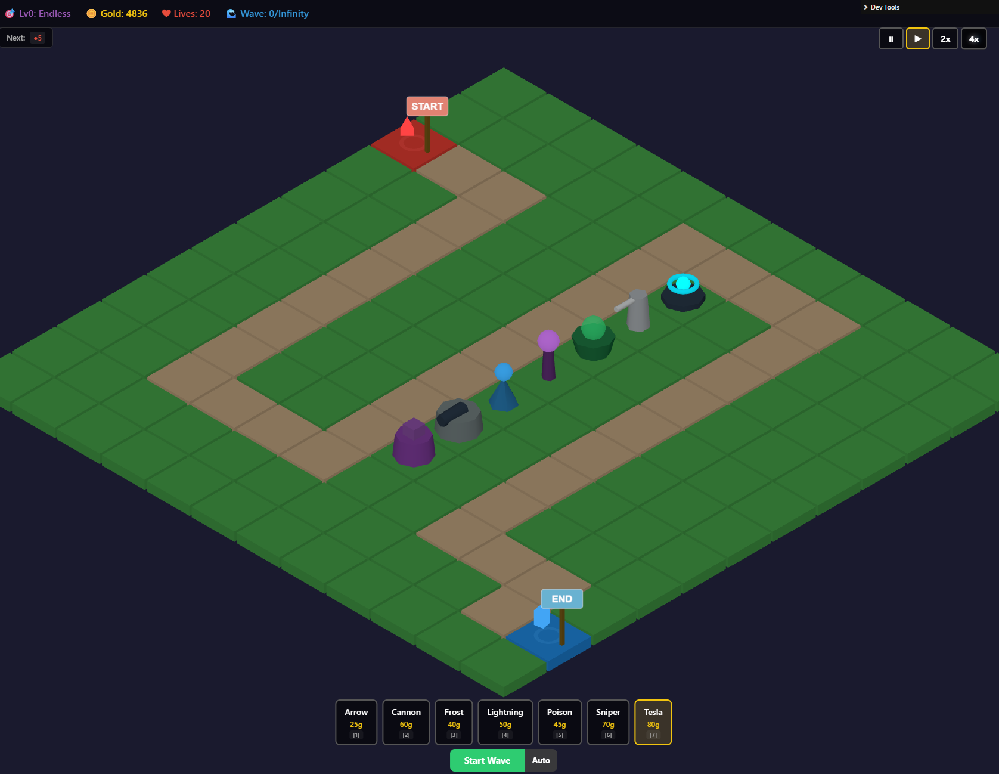
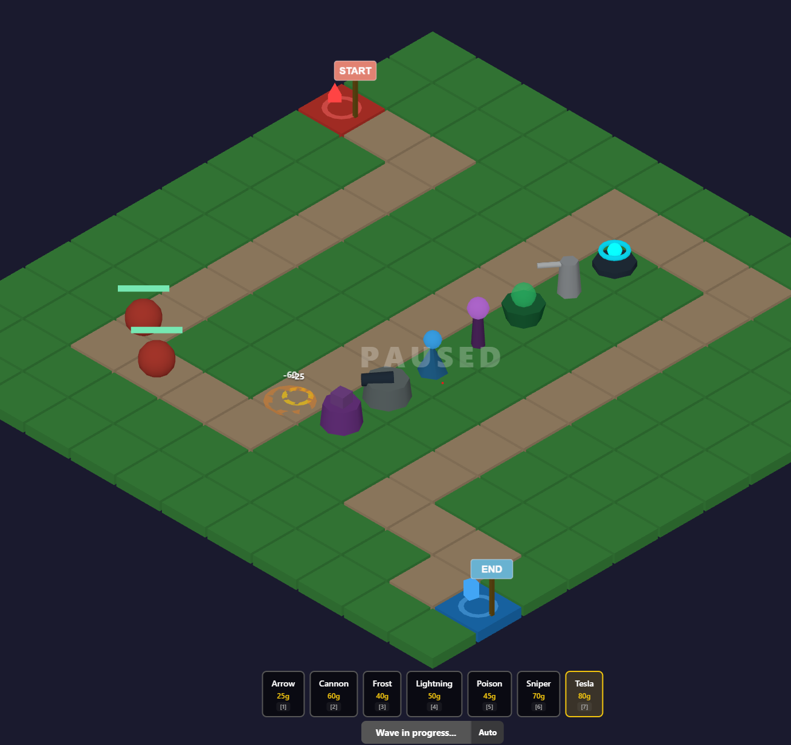
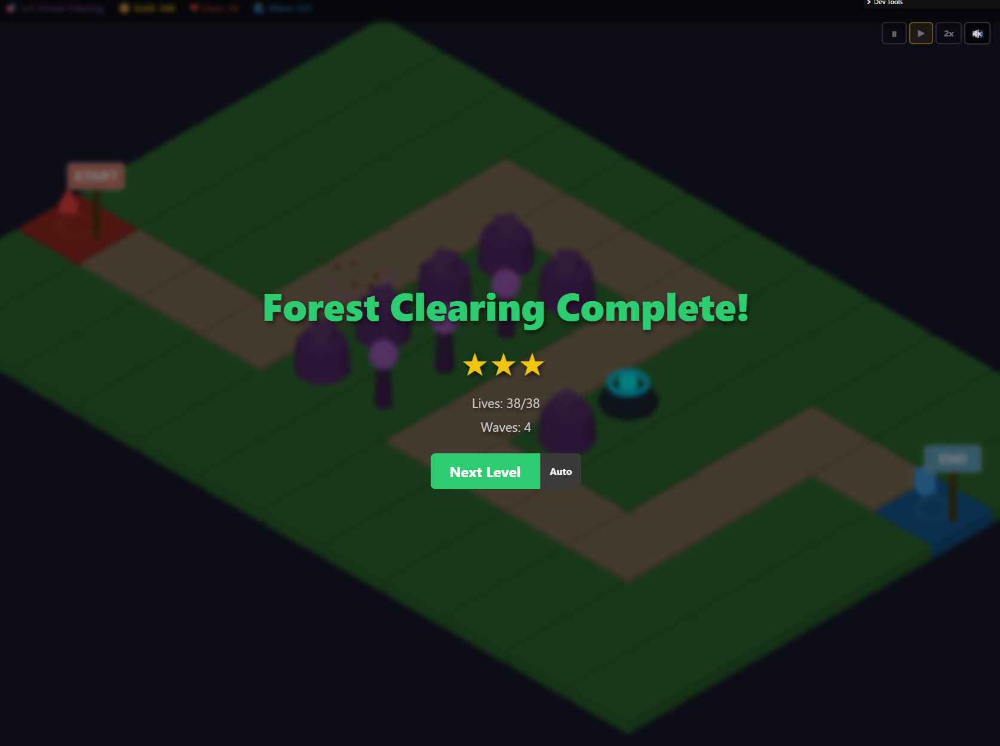

# Tower Defense

A tower defense game built with Three.js, TypeScript, and Vite. All content is procedurally generated -- maps use seeded random generation, tower models are built from Three.js primitives, and audio is synthesized at runtime via the Web Audio API.

## [Play Online](https://djpav.github.io/threejs-tower-defense/)

## Screenshots

<p align="center">
  
</p>
<p align="center">
  
  
</p>
<p align="center">
  
</p>

## Game Mechanics

### Core Loop

1. **Select a level** from the level select screen (10 campaign levels + Endless mode)
2. **Place towers** on buildable cells by clicking the grid
3. **Start a wave** -- enemies spawn and follow the path toward the goal
4. **Earn gold** from kills to build and upgrade towers
5. **Survive all waves** to complete the level with a 1-3 star rating

### Towers

7 tower types with distinct mechanics, each upgradable to level 3:

- **Arrow** -- balanced all-rounder
- **Cannon** -- splash damage in an area (can't hit flying enemies)
- **Frost** -- slows enemies on hit
- **Lightning** -- chain lightning bounces between multiple targets
- **Poison** -- applies stacking damage-over-time
- **Sniper** -- extreme range, high single-target damage, slow fire rate
- **Tesla** -- AoE pulse that hits all enemies in range simultaneously

Towers can be upgraded (improving damage, range, fire rate, and special stats), sold for 75% refund, and have their targeting priority cycled between First, Nearest, Strongest, and Weakest.

### Enemies

9 enemy types with unique behaviors:

- **Basic** -- standard enemy
- **Fast Runner** -- high speed, low HP
- **Tank** -- high HP, slow
- **Shielded** -- moderate all-around stats
- **Boss** -- massive HP pool, high gold reward
- **Flying** -- ignores the path, flies straight to the goal (some towers can't target)
- **Healer** -- heals nearby allies over time
- **Splitter** -- splits into 2 smaller enemies on death
- **Stealth** -- invisible until a tower is close enough to reveal

### Economy

- Place towers (25-80 gold), upgrade them (30-90 gold per level)
- Kill enemies for gold rewards (5-100 gold depending on type)
- Sell towers for 75% of total invested gold
- Starting gold and lives vary by level and difficulty

### Difficulty

Three difficulty modes affect enemy stats and player resources:

| Mode | Enemy HP | Enemy Speed | Gold | Lives |
|------|----------|-------------|------|-------|
| Easy | x0.7 | x0.85 | x1.3 | x1.5 |
| Normal | x1.0 | x1.0 | x1.0 | x1.0 |
| Hard | x1.5 | x1.2 | x0.8 | x0.6 |

## Controls

| Input | Action |
|-------|--------|
| Left click (empty cell) | Place selected tower |
| Left click (tower) | Select placed tower |
| `1`-`7` | Select tower type |
| `U` | Upgrade selected tower |
| `S` | Sell selected tower |
| `T` | Cycle targeting priority |
| `A` | Toggle wave auto-start |
| `L` | Toggle level auto-start |
| `Space` / `P` | Pause / Resume |
| `M` | Mute / Unmute |
| `Escape` | Deselect tower |
| Middle mouse drag | Pan camera |
| Right mouse drag | Rotate camera |
| Scroll wheel | Zoom in/out |

## Getting Started

```bash
npm install
npm run dev
```

Open http://localhost:3000

## Build

```bash
npm run dev       # dev server with HMR (localhost:3000)
npm run build     # type-check + production build to dist/
npm run preview   # preview production build
npm run test      # run unit tests
npm run test:watch  # tests in watch mode
```

## Tech Stack

- **Three.js** -- 3D rendering (OrthographicCamera, isometric view)
- **TypeScript** -- strict mode
- **Vite** -- dev server and bundler
- **Tailwind CSS v4** -- UI styling
- **Vitest** -- unit testing
- **Web Audio API** -- synthesized sound effects

## Documentation

- [Features](docs/FEATURES.md) -- complete inventory of all towers, enemies, levels, systems
- [Architecture](docs/ARCHITECTURE.md) -- directory structure, class hierarchy, game loop, event system
- [TODO](docs/TODO.md) -- planned features, known bugs, and improvement backlog
- [Testing](docs/TESTING.md) -- test coverage and what needs testing

## Project Structure

```
src/
  core/       Game orchestrator, clock, input, event bus
  entities/   Enemy, Tower, Projectile, GridCell
  systems/    Combat, waves, economy, audio, save, effects
  configs/    Tower/enemy/level balance data
  ui/         DOM-based HUD (Tailwind CSS)
  rendering/  Camera controller
  types/      Shared TypeScript types and enums
  utils/      Object pool, countdown timer
tests/        Unit tests (Vitest)
docs/         Documentation
```

## Contributing

Contributions are welcome! See [CONTRIBUTING.md](CONTRIBUTING.md) for guidelines.

## License

[MIT](LICENSE)
